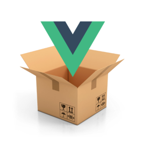

# vue-parcel

<p align="center"></p>

You can use this template with [vue-cli](https://github.com/vuejs/vue-cli).

**vue-parcel** is a Vue.js + Parcel template with hot reloading, and *supports **vue-router***.

## Basic setup

**NPM**
``` bash
npm install --global vue-cli
vue init c4rlosviteri/vue-parcel project-name
cd project-name
npm install
npm run dev
```

**Yarn**
``` bash
yarn global vue-cli
vue init c4rlosviteri/vue-parcel project-name
cd project-name
yarn install
yarn run dev
```

## TODO

* Support CSS preprocessors
* Support linters
* Support testers

## How to contribute to this project

If you are willing to help to develop this project, you can fork it and here you have some docs:

Vue.js CLI official docs → [vue-cli](https://github.com/vuejs/vue-cli/blob/master/README.md#writing-custom-templates-from-scratch)  
Prompt types from Inquirer.js → [Prompt types](https://github.com/SBoudrias/Inquirer.js/#question)
